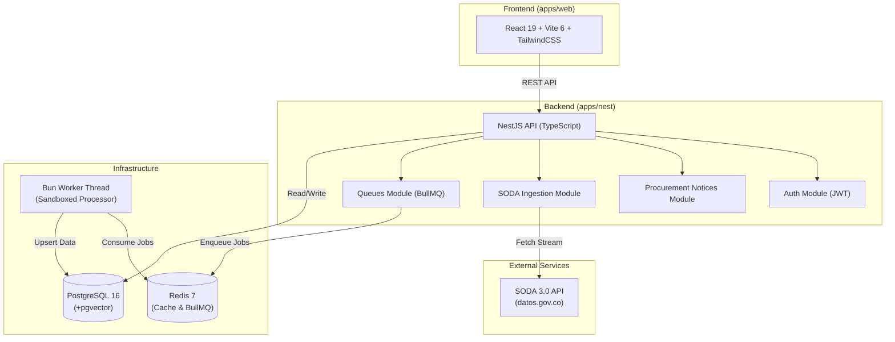
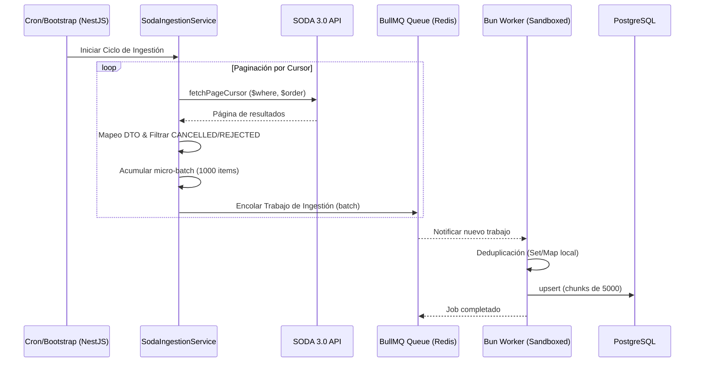
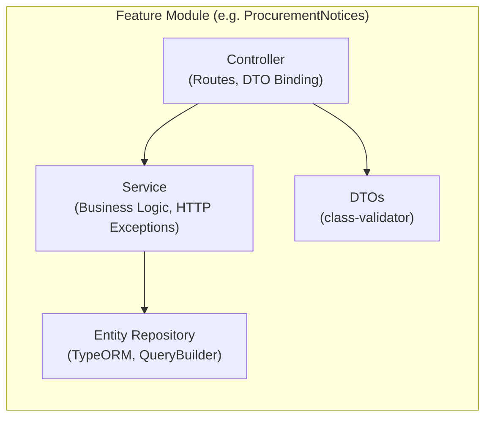

# Technical Architecture: Plataforma Licitaciones SECOP

Este documento proporciona una visión en profundidad de la arquitectura técnica, utilizando diagramas para visualizar las interacciones de los componentes y el flujo de datos. Está basado en los principios descritos en `ARCHITECTURED.md` y `AGENTS.md`.

## 1. System Architecture Overview

La plataforma sigue una arquitectura basada en monorepositorio con backend en NestJS y frontend en React, usando colas y workers sandboxed para cargas asíncronas pesadas (ej. ingestión de SODA).



## 2. Flujo de Datos SODA Ingestion

El flujo de ingestión recupera grandes volúmenes de datos (~21.8M registros) desde la API de SODA utilizando paginación por cursor y encolando en micro-batches, todo manejado por procesadores en sandbox para evitar bloquear el event loop principal de NestJS.



## 3. Flujo de Ciclo de Vida de Procurement Notices

Los registros de SECOP ("Procurement Notices") transitan a través de diferentes estados en el sistema.

```mermaid
stateDiagram-v2
    [*] --> PENDING: Ingestión inicial (Si no es CANCELLED/REJECTED)
    PENDING --> ENRICHING: Cola de Procesamiento/Enriquecimiento
    ENRICHING --> SCORING: Asignación de Puntuación (Scoring Engine)
    SCORING --> AWARDED: Licitación Finalizada (Adjudicada)
    SCORING --> REJECTED: Licitación Rechazada
    SCORING --> CANCELLED: Licitación Cancelada

    note right of PENDING: Nota: CANCELLED y REJECTED en SODA \n son filtrados durante la ingestión y no persisten.
```

## 4. Estructura de Módulos (Backend)

Cada módulo en NestJS está autocontenido y respeta las responsabilidades de separación:



## Referencias

- Principios de desarrollo: [CONVENTIONS.md](../CONVENTIONS.md)
- Arquitectura en detalle: [ARCHITECTURED.md](../ARCHITECTURED.md)
- Directrices para Agentes: [AGENTS.md](../AGENTS.md)
